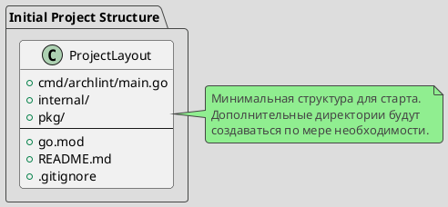

# Spec 0001: Initialize Standard Golang Project Layout

**Metadata:**
- Priority: 0001 (High)
- Status: Done
- Created: 2024-12-01
- Effort: S
- Parent Spec: -

---

## Overview

### Problem Statement
Необходимо создать базовую структуру Go проекта для инструмента archlint согласно стандартным практикам разработки.

### Solution Summary
Инициализировать Go module и создать минимальную структуру проекта с базовыми директориями и файлами конфигурации.

### Success Metrics
- Go module инициализирован
- Базовая структура директорий создана
- Проект компилируется

---

## Architecture

### Data Model



---

## Requirements

### R1: Go Module Initialization
- Инициализировать Go module с именем `github.com/mshogin/archlint`
- Указать версию Go

### R2: Minimal Directory Structure
- Создать `cmd/archlint/` для точки входа
- Создать `internal/` для приватного кода (пустая)
- Создать `pkg/` для публичных библиотек (пустая)

### R3: Entry Point
- Создать минимальный main.go с "Hello, archlint!"

### R4: Configuration Files
- Создать `.gitignore` для игнорирования build артефактов
- Создать `README.md` с базовым описанием проекта

---

## Acceptance Criteria

- [ ] AC1: go.mod создан с module path github.com/mshogin/archlint
- [ ] AC2: Директория cmd/archlint/ существует
- [ ] AC3: cmd/archlint/main.go существует и компилируется
- [ ] AC4: Директория internal/ существует
- [ ] AC5: Директория pkg/ существует
- [ ] AC6: README.md содержит базовое описание
- [ ] AC7: .gitignore настроен

---

## Implementation Steps

**Step 1:** Initialize Go module
- Files: go.mod
- Action: Create
- Details: `go mod init github.com/mshogin/archlint`

**Step 2:** Create directory structure
- Action: Create directories
- Details: `mkdir -p cmd/archlint internal pkg`

**Step 3:** Create minimal main.go
- Files: cmd/archlint/main.go
- Action: Create
- Details:
```go
package main

import "fmt"

func main() {
    fmt.Println("archlint")
}
```

**Step 4:** Create .gitignore
- Files: .gitignore
- Action: Create
- Details: Add bin/, *.exe, vendor/, .DS_Store

**Step 5:** Create README.md
- Files: README.md
- Action: Create
- Details: Basic project description

---

## Testing Strategy

### Unit Tests
- [ ] `go build ./cmd/archlint` успешно компилируется
- Coverage target: N/A (инфраструктурная задача)

---

## Notes

### References
- https://github.com/golang-standards/project-layout

### Initial Structure
```
archlint/
├── cmd/
│   └── archlint/
│       └── main.go
├── internal/
├── pkg/
├── go.mod
├── README.md
└── .gitignore
```
