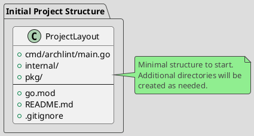

# Spec 0001: Initialize Standard Golang Project Layout

**Metadata:**
- Priority: 0001 (High)
- Status: Done
- Created: 2024-12-01
- Effort: S
- Parent Spec: -

---

## Overview

### Problem Statement
Need to create a basic Go project structure for the archlint tool following standard development practices.

### Solution Summary
Initialize Go module and create minimal project structure with basic directories and configuration files.

### Success Metrics
- Go module initialized
- Basic directory structure created
- Project compiles

---

## Architecture

### Data Model



---

## Requirements

### R1: Go Module Initialization
- Initialize Go module with name `github.com/mshogin/archlint`
- Specify Go version

### R2: Minimal Directory Structure
- Create `cmd/archlint/` for entry point
- Create `internal/` for private code (empty)
- Create `pkg/` for public libraries (empty)

### R3: Entry Point
- Create minimal main.go with "Hello, archlint!"

### R4: Configuration Files
- Create `.gitignore` to ignore build artifacts
- Create `README.md` with basic project description

---

## Acceptance Criteria

- [ ] AC1: go.mod created with module path github.com/mshogin/archlint
- [ ] AC2: Directory cmd/archlint/ exists
- [ ] AC3: cmd/archlint/main.go exists and compiles
- [ ] AC4: Directory internal/ exists
- [ ] AC5: Directory pkg/ exists
- [ ] AC6: README.md contains basic description
- [ ] AC7: .gitignore configured

---

## Implementation Steps

**Step 1:** Initialize Go module
- Files: go.mod
- Action: Create
- Details: `go mod init github.com/mshogin/archlint`

**Step 2:** Create directory structure
- Action: Create directories
- Details: `mkdir -p cmd/archlint internal pkg`

**Step 3:** Create minimal main.go
- Files: cmd/archlint/main.go
- Action: Create
- Details:
```go
package main

import "fmt"

func main() {
    fmt.Println("archlint")
}
```

**Step 4:** Create .gitignore
- Files: .gitignore
- Action: Create
- Details: Add bin/, *.exe, vendor/, .DS_Store

**Step 5:** Create README.md
- Files: README.md
- Action: Create
- Details: Basic project description

---

## Testing Strategy

### Unit Tests
- [ ] `go build ./cmd/archlint` compiles successfully
- Coverage target: N/A (infrastructure task)

---

## Notes

### References
- https://github.com/golang-standards/project-layout

### Initial Structure
```
archlint/
├── cmd/
│   └── archlint/
│       └── main.go
├── internal/
├── pkg/
├── go.mod
├── README.md
└── .gitignore
```
