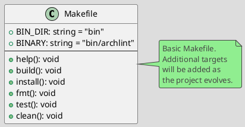

# Spec 0002: Implement Basic Makefile

**Metadata:**
- Priority: 0002 (High)
- Status: Done
- Created: 2024-12-01
- Effort: S
- Parent Spec: 0001

---

## Overview

### Problem Statement
Need to automate basic development commands (build, format, test) through a unified Makefile interface.

### Solution Summary
Create an initial Makefile with basic targets for build and development.

### Success Metrics
- `make help` shows available commands
- `make build` builds the binary
- `make fmt` formats code
- `make test` runs tests

---

## Architecture

### Data Model



---

## Requirements

### R1: Help Target
- Show list of available commands with descriptions
- Use grep to extract comments

### R2: Build Target
- Create bin/ directory
- Compile archlint to bin/archlint
- Output success message

### R3: Install Target
- Depend on build
- Install archlint to $GOPATH/bin

### R4: Format Target
- Run go fmt ./...

### R5: Test Target
- Run go test -v ./...

### R6: Clean Target
- Remove bin/

---

## Acceptance Criteria

- [ ] AC1: make help shows commands
- [ ] AC2: make build creates bin/archlint
- [ ] AC3: make install installs to GOPATH
- [ ] AC4: make fmt formats code
- [ ] AC5: make test runs tests
- [ ] AC6: make clean cleans bin/
- [ ] AC7: .DEFAULT_GOAL set to help

---

## Implementation Steps

**Step 1:** Create Makefile
- Files: Makefile
- Action: Create
- Details: Add basic targets

**Step 2:** Define variables
- Details: BIN_DIR, BINARY

**Step 3:** Implement targets
- Details: help, build, install, fmt, test, clean

---

## Testing Strategy

### Unit Tests
- [ ] `make build` compiles successfully
- Coverage target: N/A

---

## Notes

### Initial Makefile
```makefile
.PHONY: help build install clean fmt test

BIN_DIR := bin
BINARY := $(BIN_DIR)/archlint

help: ## Show help
	@grep -E '^[a-zA-Z_-]+:.*?## .*$$' $(MAKEFILE_LIST) | sort | awk 'BEGIN {FS = ":.*?## "}; {printf "  \033[36m%-15s\033[0m %s\n", $$1, $$2}'

build: ## Build project
	@mkdir -p $(BIN_DIR)
	go build -o $(BINARY) ./cmd/archlint

install: build ## Install to GOPATH
	go install ./cmd/archlint

fmt: ## Format code
	go fmt ./...

test: ## Run tests
	go test -v ./...

clean: ## Clean artifacts
	rm -rf $(BIN_DIR)

.DEFAULT_GOAL := help
```
