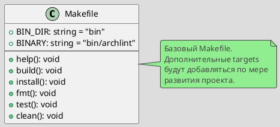

# Spec 0002: Implement Basic Makefile

**Metadata:**
- Priority: 0002 (High)
- Status: Done
- Created: 2024-12-01
- Effort: S
- Parent Spec: 0001

---

## Overview

### Problem Statement
Необходимо автоматизировать базовые команды разработки (сборка, форматирование, тестирование) через единый интерфейс Makefile.

### Solution Summary
Создать начальный Makefile с базовыми целями для сборки и разработки.

### Success Metrics
- `make help` показывает доступные команды
- `make build` собирает бинарник
- `make fmt` форматирует код
- `make test` запускает тесты

---

## Architecture

### Data Model



---

## Requirements

### R1: Help Target
- Показывать список доступных команд с описаниями
- Использовать grep для извлечения комментариев

### R2: Build Target
- Создавать директорию bin/
- Компилировать archlint в bin/archlint
- Выводить сообщение об успешной сборке

### R3: Install Target
- Зависеть от build
- Устанавливать archlint в $GOPATH/bin

### R4: Format Target
- Запускать go fmt ./...

### R5: Test Target
- Запускать go test -v ./...

### R6: Clean Target
- Удалять bin/

---

## Acceptance Criteria

- [ ] AC1: make help показывает команды
- [ ] AC2: make build создает bin/archlint
- [ ] AC3: make install устанавливает в GOPATH
- [ ] AC4: make fmt форматирует код
- [ ] AC5: make test запускает тесты
- [ ] AC6: make clean очищает bin/
- [ ] AC7: .DEFAULT_GOAL установлен в help

---

## Implementation Steps

**Step 1:** Create Makefile
- Files: Makefile
- Action: Create
- Details: Add basic targets

**Step 2:** Define variables
- Details: BIN_DIR, BINARY

**Step 3:** Implement targets
- Details: help, build, install, fmt, test, clean

---

## Testing Strategy

### Unit Tests
- [ ] `make build` успешно компилирует
- Coverage target: N/A

---

## Notes

### Initial Makefile
```makefile
.PHONY: help build install clean fmt test

BIN_DIR := bin
BINARY := $(BIN_DIR)/archlint

help: ## Show help
	@grep -E '^[a-zA-Z_-]+:.*?## .*$$' $(MAKEFILE_LIST) | sort | awk 'BEGIN {FS = ":.*?## "}; {printf "  \033[36m%-15s\033[0m %s\n", $$1, $$2}'

build: ## Build project
	@mkdir -p $(BIN_DIR)
	go build -o $(BINARY) ./cmd/archlint

install: build ## Install to GOPATH
	go install ./cmd/archlint

fmt: ## Format code
	go fmt ./...

test: ## Run tests
	go test -v ./...

clean: ## Clean artifacts
	rm -rf $(BIN_DIR)

.DEFAULT_GOAL := help
```

