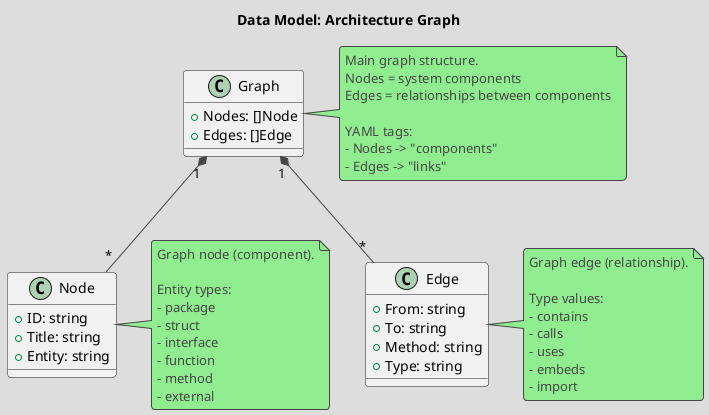

# Spec 0003: Define Graph Data Model

**Metadata:**
- Priority: 0003 (High)
- Status: Done
- Created: 2024-12-01
- Effort: S
- Parent Spec: 0001

---

## Overview

### Problem Statement
Need to define data structures for representing an architecture graph that will store information about components and relationships between them.

### Solution Summary
Create package internal/model with Graph, Node, and Edge types to represent an architecture graph with YAML serialization support.

### Success Metrics
- Types defined and documented
- YAML tags enable correct serialization
- Code compiles without errors

---

## Architecture

### Data Model



---

## Requirements

### R1: Graph Type
**Description:** Root type for representing the architecture graph

```go
// Package: internal/model
// File: model.go

type Graph struct {
    Nodes []Node `yaml:"components"`
    Edges []Edge `yaml:"links"`
}
```

### R2: Node Type
**Description:** Type for representing a graph node (component)

```go
type Node struct {
    ID     string `yaml:"id"`
    Title  string `yaml:"title"`
    Entity string `yaml:"entity"`
}
```

**Entity Values:**
- `package` - Go package
- `struct` - structure
- `interface` - interface
- `function` - function
- `method` - method
- `external` - external dependency

### R3: Edge Type
**Description:** Type for representing a graph edge (relationship)

```go
type Edge struct {
    From   string `yaml:"from"`
    To     string `yaml:"to"`
    Method string `yaml:"method,omitempty"`
    Type   string `yaml:"type,omitempty"`
}
```

**Type Values:**
- `contains` - contains (package->type, type->method)
- `calls` - calls (function->function)
- `uses` - uses (type->type in field)
- `embeds` - embeds (type->type embedding)
- `import` - imports (package->package)

---

## Acceptance Criteria

- [ ] AC1: Package internal/model created
- [ ] AC2: Graph type defined with YAML tags
- [ ] AC3: Node type defined with YAML tags
- [ ] AC4: Edge type defined with YAML tags
- [ ] AC5: YAML tag for Nodes = "components"
- [ ] AC6: YAML tag for Edges = "links"
- [ ] AC7: Code compiles without errors
- [ ] AC8: Package contains godoc comments

---

## Implementation Steps

**Step 1:** Create model package directory
- Files: internal/model/
- Action: Create directory
- Details: `mkdir -p internal/model`

**Step 2:** Create model.go
- Files: internal/model/model.go
- Action: Create
- Details: Create package with types

**Step 2:** Define Graph type
- Details: Add Nodes and Edges fields with YAML tags

**Step 3:** Define Node type
- Details: Add ID, Title, Entity fields

**Step 4:** Define Edge type
- Details: Add From, To, Method, Type fields

**Step 5:** Add documentation
- Details: Add godoc comments

---

## Testing Strategy

### Unit Tests
- [ ] Types compile
- [ ] YAML serialization works correctly
- Coverage target: N/A (type definitions only)

---

## Notes

### YAML Output Example
```yaml
components:
  - id: cmd/archlint
    title: main
    entity: package
  - id: cmd/archlint.main
    title: main
    entity: function
  - id: internal/analyzer.GoAnalyzer
    title: GoAnalyzer
    entity: struct

links:
  - from: cmd/archlint
    to: cmd/archlint.main
    type: contains
  - from: cmd/archlint.main
    to: internal/analyzer.NewGoAnalyzer
    type: calls
```

### Design Decisions
- Using YAML tags "components" and "links" instead of "nodes" and "edges" for DocHub compatibility
- Method field is optional (omitempty) for method calls
- Type field is optional for backward compatibility
