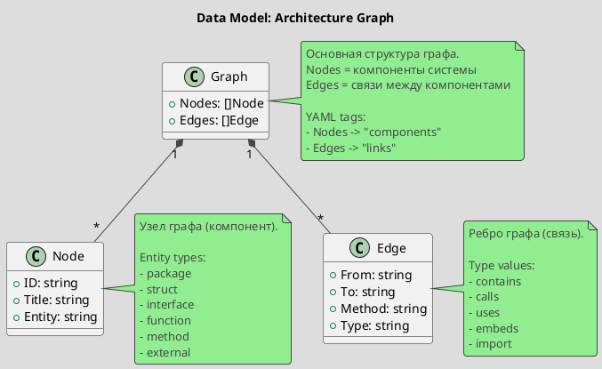

# Spec 0003: Define Graph Data Model

**Metadata:**
- Priority: 0003 (High)
- Status: Done
- Created: 2024-12-01
- Effort: S
- Parent Spec: 0001

---

## Overview

### Problem Statement
Необходимо определить структуры данных для представления архитектурного графа, который будет хранить информацию о компонентах и связях между ними.

### Solution Summary
Создать пакет internal/model с типами Graph, Node и Edge для представления архитектурного графа с поддержкой сериализации в YAML.

### Success Metrics
- Типы определены и документированы
- YAML теги позволяют корректную сериализацию
- Код компилируется без ошибок

---

## Architecture

### Data Model



---

## Requirements

### R1: Graph Type
**Description:** Корневой тип для представления архитектурного графа

```go
// Package: internal/model
// File: model.go

type Graph struct {
    Nodes []Node `yaml:"components"`
    Edges []Edge `yaml:"links"`
}
```

### R2: Node Type
**Description:** Тип для представления узла графа (компонента)

```go
type Node struct {
    ID     string `yaml:"id"`
    Title  string `yaml:"title"`
    Entity string `yaml:"entity"`
}
```

**Entity Values:**
- `package` - Go пакет
- `struct` - структура
- `interface` - интерфейс
- `function` - функция
- `method` - метод
- `external` - внешняя зависимость

### R3: Edge Type
**Description:** Тип для представления ребра графа (связи)

```go
type Edge struct {
    From   string `yaml:"from"`
    To     string `yaml:"to"`
    Method string `yaml:"method,omitempty"`
    Type   string `yaml:"type,omitempty"`
}
```

**Type Values:**
- `contains` - содержит (package->type, type->method)
- `calls` - вызывает (function->function)
- `uses` - использует (type->type в поле)
- `embeds` - встраивает (type->type embedding)
- `import` - импортирует (package->package)

---

## Acceptance Criteria

- [ ] AC1: Package internal/model создан
- [ ] AC2: Тип Graph определен с YAML тегами
- [ ] AC3: Тип Node определен с YAML тегами
- [ ] AC4: Тип Edge определен с YAML тегами
- [ ] AC5: YAML тег для Nodes = "components"
- [ ] AC6: YAML тег для Edges = "links"
- [ ] AC7: Код компилируется без ошибок
- [ ] AC8: Package содержит godoc комментарии

---

## Implementation Steps

**Step 1:** Create model package directory
- Files: internal/model/
- Action: Create directory
- Details: `mkdir -p internal/model`

**Step 2:** Create model.go
- Files: internal/model/model.go
- Action: Create
- Details: Create package with types

**Step 2:** Define Graph type
- Details: Add Nodes and Edges fields with YAML tags

**Step 3:** Define Node type
- Details: Add ID, Title, Entity fields

**Step 4:** Define Edge type
- Details: Add From, To, Method, Type fields

**Step 5:** Add documentation
- Details: Add godoc comments

---

## Testing Strategy

### Unit Tests
- [ ] Типы компилируются
- [ ] YAML сериализация работает корректно
- Coverage target: N/A (только определения типов)

---

## Notes

### YAML Output Example
```yaml
components:
  - id: cmd/archlint
    title: main
    entity: package
  - id: cmd/archlint.main
    title: main
    entity: function
  - id: internal/analyzer.GoAnalyzer
    title: GoAnalyzer
    entity: struct

links:
  - from: cmd/archlint
    to: cmd/archlint.main
    type: contains
  - from: cmd/archlint.main
    to: internal/analyzer.NewGoAnalyzer
    type: calls
```

### Design Decisions
- Использование YAML тегов "components" и "links" вместо "nodes" и "edges" для совместимости с DocHub
- Method поле опциональное (omitempty) для вызовов методов
- Type поле опциональное для обратной совместимости
