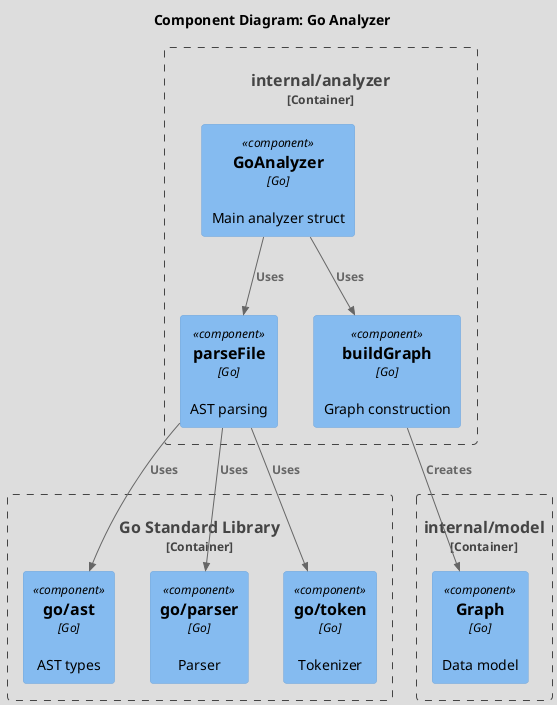
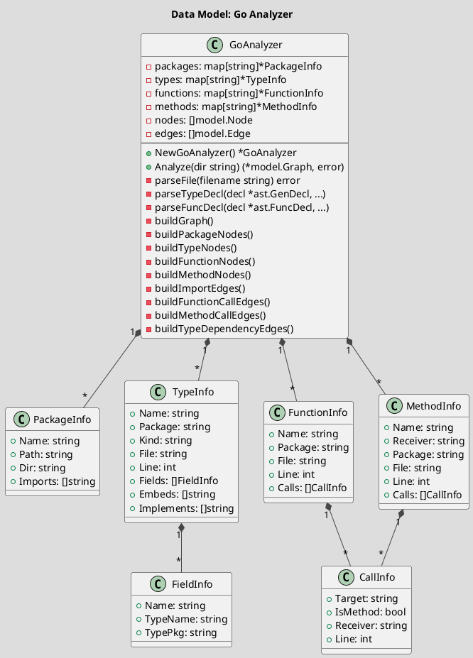
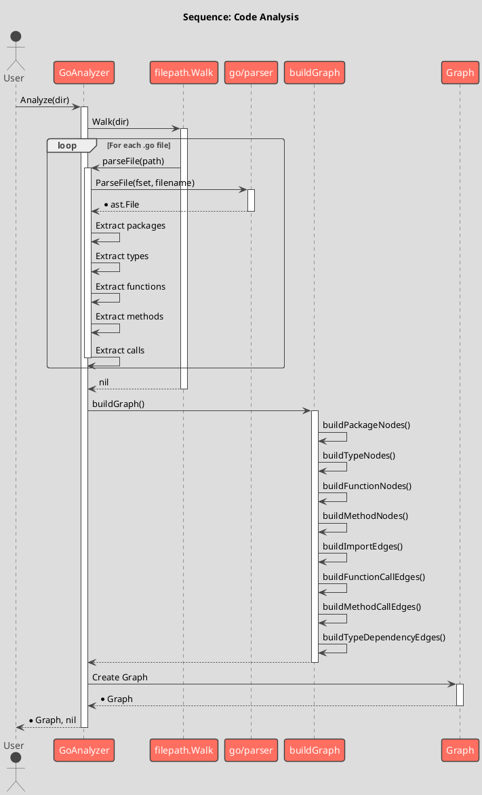

# Spec 0004: Implement Go Code Analyzer

**Metadata:**
- Priority: 0004 (High)
- Status: Done
- Created: 2024-12-01
- Effort: L
- Parent Spec: 0003

---

## Overview

### Problem Statement
Необходимо реализовать анализатор Go кода, который парсит исходный код с помощью AST и строит граф зависимостей между компонентами (пакетами, типами, функциями, методами).

### Solution Summary
Создать GoAnalyzer в пакете internal/analyzer, который использует go/ast и go/parser для анализа Go файлов и построения графа модели.

### Success Metrics
- Анализатор корректно парсит Go код
- Все типы компонентов извлекаются (package, struct, interface, function, method)
- Все типы связей определяются (contains, calls, uses, embeds, import)
- Внешние зависимости идентифицируются

---

## Architecture

### Component Overview (C4 Component)



### Data Model



### Sequence Flow



---

## Requirements

### R1: GoAnalyzer Type
**Description:** Основной тип анализатора

```go
// Package: internal/analyzer
// File: go.go

type GoAnalyzer struct {
    packages  map[string]*PackageInfo
    types     map[string]*TypeInfo
    functions map[string]*FunctionInfo
    methods   map[string]*MethodInfo
    nodes     []model.Node
    edges     []model.Edge
}

func NewGoAnalyzer() *GoAnalyzer
func (a *GoAnalyzer) Analyze(dir string) (*model.Graph, error)
```

### R2: File Walking
**Description:** Обход директории с фильтрацией

- Пропускать vendor/, node_modules/, .git/, bin/
- Пропускать не-.go файлы
- Пропускать _test.go файлы

### R3: AST Parsing
**Description:** Парсинг Go файлов

- Извлечение имени пакета
- Извлечение импортов (кроме stdlib)
- Извлечение объявлений типов (struct, interface)
- Извлечение функций и методов
- Извлечение вызовов функций/методов

### R4: Graph Building
**Description:** Построение графа из собранной информации

- Package nodes с типом "package"
- Type nodes с типом "struct"/"interface"
- Function nodes с типом "function"
- Method nodes с типом "method"
- External dependency nodes с типом "external"
- Contains edges (package->type, type->method)
- Import edges (package->package)
- Calls edges (function->function)
- Uses edges (type->type)
- Embeds edges (type->type)

### R5: Call Resolution
**Description:** Разрешение целей вызовов

- Проверка существования цели в known functions/methods
- Фильтрация builtin функций (make, new, len, etc.)
- Пропуск нерезольвленных вызовов

### R6: Type Dependency Resolution
**Description:** Разрешение зависимостей типов

- Фильтрация примитивных типов
- Резолвинг локальных типов
- Резолвинг импортированных типов

---

## Acceptance Criteria

- [ ] AC1: NewGoAnalyzer() создает экземпляр
- [ ] AC2: Analyze() обходит директорию
- [ ] AC3: Пропускаются vendor, .git, bin
- [ ] AC4: Пропускаются _test.go файлы
- [ ] AC5: Извлекаются пакеты
- [ ] AC6: Извлекаются struct типы
- [ ] AC7: Извлекаются interface типы
- [ ] AC8: Извлекаются функции
- [ ] AC9: Извлекаются методы
- [ ] AC10: Определяются вызовы
- [ ] AC11: Определяются импорты
- [ ] AC12: Строятся contains edges
- [ ] AC13: Строятся calls edges
- [ ] AC14: Строятся uses edges
- [ ] AC15: Строятся embeds edges
- [ ] AC16: External dependencies создаются
- [ ] AC17: Stdlib imports фильтруются
- [ ] AC18: Builtin functions фильтруются
- [ ] AC19: Примитивные типы фильтруются
- [ ] AC20: tracer.Enter/Exit в каждой функции

---

## Implementation Steps

### Phase 1: Core Structure
**Step 1.1:** Create analyzer package directory
- Files: internal/analyzer/
- Action: Create directory
- Details: `mkdir -p internal/analyzer`

**Step 1.2:** Create go.go
- Files: internal/analyzer/go.go
- Action: Create

**Step 1.2:** Define info types
- Details: PackageInfo, TypeInfo, FieldInfo, FunctionInfo, MethodInfo, CallInfo

**Step 1.3:** Define GoAnalyzer type
- Details: Fields and constructor

### Phase 2: Parsing
**Step 2.1:** Implement Analyze()
- Details: filepath.Walk with filtering

**Step 2.2:** Implement parseFile()
- Details: go/parser.ParseFile, extract imports

**Step 2.3:** Implement parseTypeDecl()
- Details: Extract struct/interface info

**Step 2.4:** Implement parseFuncDecl()
- Details: Extract function/method info

**Step 2.5:** Implement collectCalls()
- Details: AST inspect for call expressions

### Phase 3: Graph Building
**Step 3.1:** Implement buildPackageNodes()
**Step 3.2:** Implement buildTypeNodes()
**Step 3.3:** Implement buildFunctionNodes()
**Step 3.4:** Implement buildMethodNodes()
**Step 3.5:** Implement buildImportEdges()
**Step 3.6:** Implement buildFunctionCallEdges()
**Step 3.7:** Implement buildMethodCallEdges()
**Step 3.8:** Implement buildTypeDependencyEdges()

### Phase 4: Resolution
**Step 4.1:** Implement resolveCallTarget()
**Step 4.2:** Implement resolveTypeDependency()
**Step 4.3:** Implement helper functions

---

## Testing Strategy

### Unit Tests
- [ ] Test parsing simple package
- [ ] Test parsing struct
- [ ] Test parsing interface
- [ ] Test parsing function
- [ ] Test parsing method
- [ ] Test call extraction
- Coverage target: 80%+

### Integration Tests
- [ ] Test full analysis on sample code
- [ ] Verify graph structure

---

## Notes

### Skipped Directories
```go
if name == "vendor" || name == "node_modules" || name == ".git" || name == "bin" {
    return filepath.SkipDir
}
```

### Stdlib Detection
```go
func (a *GoAnalyzer) isStdLib(importPath string) bool {
    // No dots and no slashes = stdlib
    if !strings.Contains(importPath, ".") && !strings.Contains(importPath, "/") {
        return true
    }
    // Known prefixes
    stdlibPrefixes := []string{"fmt", "io", "os", ...}
    // Check prefix match
}
```

### Builtin Functions
```go
builtins := map[string]bool{
    "make": true, "new": true, "len": true, "cap": true,
    "append": true, "copy": true, "delete": true, "close": true,
    "panic": true, "recover": true, "print": true, "println": true,
}
```
