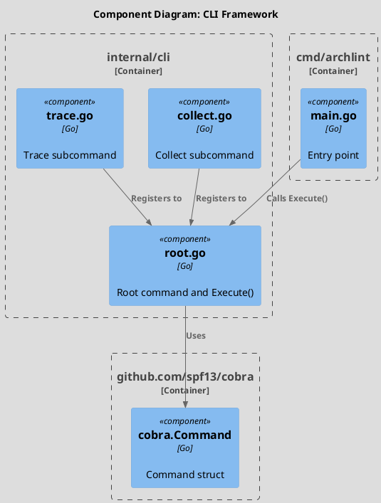
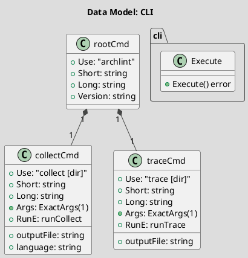

# Spec 0005: Implement CLI Framework

**Metadata:**
- Priority: 0005 (High)
- Status: Done
- Created: 2024-12-01
- Effort: S
- Parent Spec: 0001

---

## Overview

### Problem Statement
Необходимо реализовать интерфейс командной строки (CLI) для archlint с поддержкой подкоманд, флагов и справки.

### Solution Summary
Использовать библиотеку Cobra для создания CLI с корневой командой и подкомандами (collect, trace).

### Success Metrics
- CLI запускается без ошибок
- `archlint --help` показывает справку
- `archlint --version` показывает версию
- Подкоманды регистрируются корректно

---

## Architecture

### Component Overview (C4 Component)



### Data Model



---

## Requirements

### R1: Root Command
**Description:** Корневая команда archlint

```go
// Package: internal/cli
// File: root.go

var version = "0.1.0"

var rootCmd = &cobra.Command{
    Use:     "archlint",
    Short:   "Инструмент для построения архитектурных графов",
    Long:    `archlint - инструмент для построения структурных графов и графов поведения
из исходного кода на языке Go.`,
    Version: version,
}

func Execute() error {
    if err := rootCmd.Execute(); err != nil {
        return fmt.Errorf("ошибка выполнения команды: %w", err)
    }
    return nil
}
```

### R2: Entry Point
**Description:** Точка входа приложения

```go
// Package: main
// File: cmd/archlint/main.go

func main() {
    tracer.Enter("main")

    if err := cli.Execute(); err != nil {
        tracer.ExitError("main", err)
        os.Exit(1)
    }

    tracer.ExitSuccess("main")
}
```

### R3: Subcommand Registration
**Description:** Подкоманды регистрируются в init()

```go
func init() {
    rootCmd.AddCommand(collectCmd)
    rootCmd.AddCommand(traceCmd)
}
```

---

## Acceptance Criteria

- [ ] AC1: Package internal/cli создан
- [ ] AC2: rootCmd определен
- [ ] AC3: Execute() функция экспортирована
- [ ] AC4: cmd/archlint/main.go вызывает cli.Execute()
- [ ] AC5: Version установлен в "0.1.0"
- [ ] AC6: archlint --help работает
- [ ] AC7: archlint --version работает
- [ ] AC8: tracer.Enter/Exit в Execute()
- [ ] AC9: tracer.Enter/Exit в main()

---

## Implementation Steps

**Step 1:** Create cli package directory
- Files: internal/cli/
- Action: Create directory
- Details: `mkdir -p internal/cli`

**Step 2:** Add Cobra dependency
- Action: Run
- Details: `go get github.com/spf13/cobra`

**Step 3:** Create root.go
- Files: internal/cli/root.go
- Action: Create
- Details: Define rootCmd and Execute()

**Step 4:** Update main.go
- Files: cmd/archlint/main.go
- Action: Modify
- Details: Call cli.Execute() instead of fmt.Println

---

## Testing Strategy

### Unit Tests
- [ ] Execute() не возвращает ошибку при --help
- Coverage target: N/A

---

## Notes

### Cobra Command Structure
```
archlint
├── collect [dir] -o output.yaml -l go
└── trace [dir] -o contexts.yaml
```

### Error Handling
- Все ошибки оборачиваются в fmt.Errorf с контекстом
- main() вызывает os.Exit(1) при ошибке
