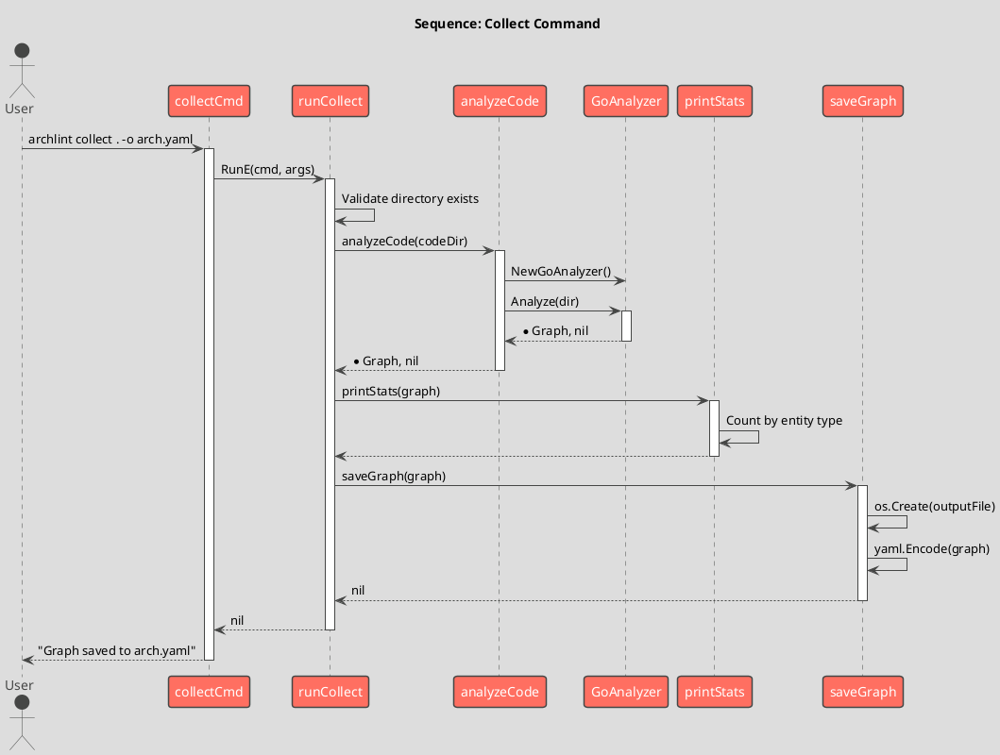
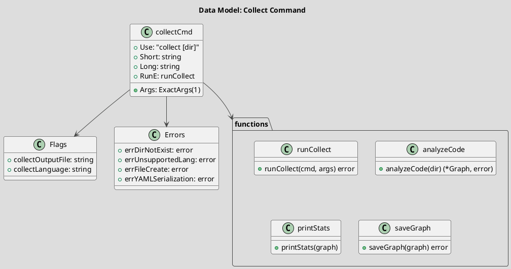

# Spec 0006: Implement Collect Command

**Metadata:**
- Priority: 0006 (High)
- Status: Done
- Created: 2024-12-01
- Effort: M
- Parent Spec: 0005

---

## Overview

### Problem Statement
Необходимо реализовать команду `collect` для сбора архитектуры из исходного кода и сохранения графа в YAML файл.

### Solution Summary
Создать подкоманду collect, которая использует GoAnalyzer для анализа кода и сохраняет результат в YAML формате.

### Success Metrics
- Команда принимает директорию как аргумент
- Поддерживаются флаги -o (output) и -l (language)
- Результат сохраняется в YAML файл
- Выводится статистика по компонентам

---

## Architecture

### Sequence Flow



### Data Model



---

## Requirements

### R1: Command Definition
**Description:** Определение команды collect

```go
// Package: internal/cli
// File: collect.go

var collectCmd = &cobra.Command{
    Use:   "collect [директория]",
    Short: "Сбор архитектуры из исходного кода",
    Long: `Анализирует исходный код и строит граф архитектуры в формате YAML.

Пример:
  archlint collect . -l go -o architecture.yaml`,
    Args: cobra.ExactArgs(1),
    RunE: runCollect,
}
```

### R2: Flags
**Description:** Флаги команды

```go
var (
    collectOutputFile string
    collectLanguage   string
)

func init() {
    collectCmd.Flags().StringVarP(&collectOutputFile, "output", "o",
        "architecture.yaml", "Выходной YAML файл")
    collectCmd.Flags().StringVarP(&collectLanguage, "language", "l",
        "go", "Язык программирования (go)")
    rootCmd.AddCommand(collectCmd)
}
```

### R3: Run Function
**Description:** Основная функция выполнения

```go
func runCollect(cmd *cobra.Command, args []string) error {
    codeDir := args[0]

    // Validate directory exists
    if _, err := os.Stat(codeDir); os.IsNotExist(err) {
        return fmt.Errorf("%w: %s", errDirNotExist, codeDir)
    }

    // Analyze code
    graph, err := analyzeCode(codeDir)
    if err != nil {
        return err
    }

    // Print statistics
    printStats(graph)

    // Save graph
    if err := saveGraph(graph); err != nil {
        return err
    }

    return nil
}
```

### R4: Statistics Output
**Description:** Вывод статистики

```
Анализ кода: . (язык: go)
Найдено компонентов: 95
  - package: 5
  - struct: 23
  - function: 30
  - method: 21
  - external: 15
Найдено связей: 129
```

### R5: Error Types
**Description:** Статические ошибки

```go
var (
    errDirNotExist       = errors.New("директория не существует")
    errUnsupportedLang   = errors.New("неподдерживаемый язык")
    errFileCreate        = errors.New("ошибка создания файла")
    errYAMLSerialization = errors.New("ошибка сериализации YAML")
)
```

---

## Acceptance Criteria

- [ ] AC1: collectCmd определен
- [ ] AC2: Флаг -o/--output работает
- [ ] AC3: Флаг -l/--language работает
- [ ] AC4: Default output = "architecture.yaml"
- [ ] AC5: Default language = "go"
- [ ] AC6: Проверка существования директории
- [ ] AC7: Вызов GoAnalyzer.Analyze()
- [ ] AC8: Вывод статистики по entity типам
- [ ] AC9: Сохранение в YAML с отступом 2
- [ ] AC10: Сообщение об успешном сохранении
- [ ] AC11: tracer.Enter/Exit во всех функциях
- [ ] AC12: Статические ошибки определены
- [ ] AC13: Ошибки оборачиваются с контекстом

---

## Implementation Steps

**Step 1:** Define command and flags
- Files: internal/cli/collect.go
- Action: Create
- Details: collectCmd, flags, init()

**Step 2:** Implement runCollect()
- Details: Validate, analyze, print, save

**Step 3:** Implement analyzeCode()
- Details: Switch on language, call GoAnalyzer

**Step 4:** Implement printStats()
- Details: Count entities by type

**Step 5:** Implement saveGraph()
- Details: Create file, YAML encode with indent 2

**Step 6:** Add error types
- Details: Define static error variables

**Step 7:** Add tracer calls
- Details: Enter/Exit in all functions

---

## Testing Strategy

### Unit Tests
- [ ] Test runCollect with valid directory
- [ ] Test runCollect with invalid directory
- [ ] Test saveGraph creates file
- Coverage target: 80%+

### Integration Tests
- [ ] Test full collect command on sample code

**Step 8:** Update Makefile
- Files: Makefile
- Action: Modify
- Details: Add collect target and GRAPH_DIR variable

---

## Notes

### Makefile Addition
```makefile
GRAPH_DIR := arch
OUTPUT_ARCH := architecture.yaml

collect: build ## Build structural graph
	@mkdir -p $(GRAPH_DIR)
	$(BINARY) collect . -o $(GRAPH_DIR)/$(OUTPUT_ARCH)
```

### YAML Output Format
```yaml
components:
  - id: cmd/archlint
    title: main
    entity: package
links:
  - from: cmd/archlint
    to: cmd/archlint.main
    type: contains
```

### File Handling
- Использовать yaml.NewEncoder с SetIndent(2)
- Закрывать file и encoder в defer
- Логировать ошибки закрытия
