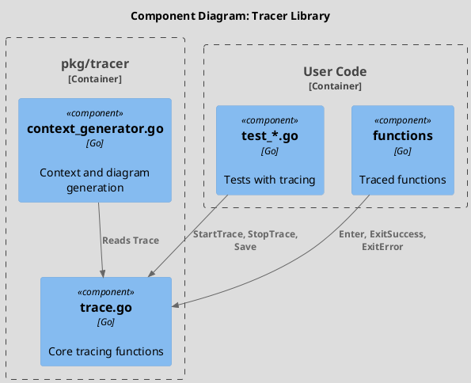
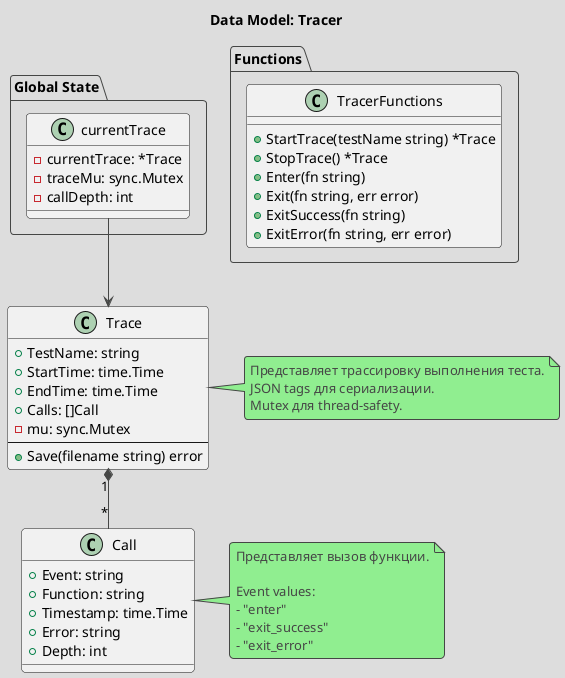
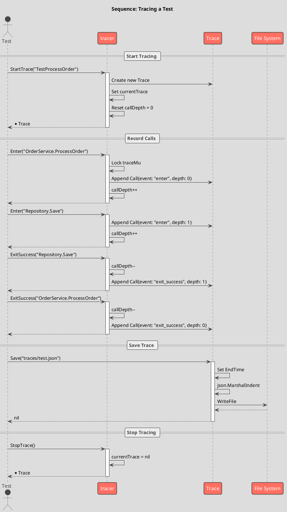

# Spec 0007: Implement Tracer Library

**Metadata:**
- Priority: 0007 (High)
- Status: Done
- Created: 2024-12-01
- Effort: M
- Parent Spec: 0001

---

## Overview

### Problem Statement
Необходимо реализовать библиотеку трассировки для записи execution flow в тестах. Это позволит строить behavioral graphs на основе реального выполнения кода.

### Solution Summary
Создать пакет pkg/tracer с функциями для записи входа/выхода из функций и сохранения трассировки в JSON формат.

### Success Metrics
- StartTrace() начинает новую трассировку
- Enter()/ExitSuccess()/ExitError() записывают события
- Save() сохраняет трассировку в JSON файл
- Thread-safe операции

---

## Architecture

### Component Overview (C4 Component)



### Data Model



### Sequence Flow



---

## Requirements

### R1: Trace Type
**Description:** Тип для хранения трассировки

```go
// Package: pkg/tracer
// File: trace.go

type Trace struct {
    TestName  string    `json:"test_name"`
    StartTime time.Time `json:"start_time"`
    EndTime   time.Time `json:"end_time"`
    Calls     []Call    `json:"calls"`
    mu        sync.Mutex
}
```

### R2: Call Type
**Description:** Тип для записи вызова

```go
type Call struct {
    Event     string    `json:"event"`
    Function  string    `json:"function"`
    Timestamp time.Time `json:"timestamp"`
    Error     string    `json:"error,omitempty"`
    Depth     int       `json:"depth"`
}
```

### R3: Global State
**Description:** Глобальное состояние для текущей трассировки

```go
var (
    currentTrace *Trace
    traceMu      sync.Mutex
    callDepth    int
)
```

### R4: StartTrace Function
**Description:** Начало новой трассировки

```go
func StartTrace(testName string) *Trace {
    traceMu.Lock()
    defer traceMu.Unlock()

    currentTrace = &Trace{
        TestName:  testName,
        StartTime: time.Now(),
        Calls:     []Call{},
    }
    callDepth = 0

    return currentTrace
}
```

### R5: Enter Function
**Description:** Запись входа в функцию

```go
func Enter(fn string) {
    traceMu.Lock()
    defer traceMu.Unlock()

    if currentTrace == nil {
        return
    }

    currentTrace.mu.Lock()
    defer currentTrace.mu.Unlock()

    currentTrace.Calls = append(currentTrace.Calls, Call{
        Event:     "enter",
        Function:  fn,
        Timestamp: time.Now(),
        Depth:     callDepth,
    })

    callDepth++
}
```

### R6: ExitSuccess Function
**Description:** Запись успешного выхода

```go
func ExitSuccess(fn string) {
    traceMu.Lock()
    defer traceMu.Unlock()

    if currentTrace == nil {
        return
    }

    callDepth--
    if callDepth < 0 {
        callDepth = 0
    }

    currentTrace.mu.Lock()
    defer currentTrace.mu.Unlock()

    currentTrace.Calls = append(currentTrace.Calls, Call{
        Event:     "exit_success",
        Function:  fn,
        Timestamp: time.Now(),
        Depth:     callDepth,
    })
}
```

### R7: ExitError Function
**Description:** Запись выхода с ошибкой

```go
func ExitError(fn string, err error) {
    // Similar to ExitSuccess but with error message
    // Event: "exit_error"
    // Error: err.Error()
}
```

### R8: Exit Function (Deprecated)
**Description:** Обертка для обратной совместимости

```go
func Exit(fn string, err error) {
    if err != nil {
        ExitError(fn, err)
    } else {
        ExitSuccess(fn)
    }
}
```

### R9: Save Method
**Description:** Сохранение трассировки в файл

```go
func (t *Trace) Save(filename string) error {
    t.mu.Lock()
    defer t.mu.Unlock()

    t.EndTime = time.Now()

    data, err := json.MarshalIndent(t, "", "  ")
    if err != nil {
        return fmt.Errorf("ошибка сериализации трассировки: %w", err)
    }

    if err := os.WriteFile(filename, data, 0o600); err != nil {
        return fmt.Errorf("ошибка записи файла трассировки: %w", err)
    }

    return nil
}
```

### R10: StopTrace Function
**Description:** Остановка текущей трассировки

```go
func StopTrace() *Trace {
    traceMu.Lock()
    defer traceMu.Unlock()

    trace := currentTrace
    currentTrace = nil
    callDepth = 0

    return trace
}
```

---

## Acceptance Criteria

- [ ] AC1: Package pkg/tracer создан
- [ ] AC2: Trace тип с JSON тегами
- [ ] AC3: Call тип с JSON тегами
- [ ] AC4: StartTrace() инициализирует трассировку
- [ ] AC5: Enter() записывает "enter" событие
- [ ] AC6: ExitSuccess() записывает "exit_success"
- [ ] AC7: ExitError() записывает "exit_error" с сообщением
- [ ] AC8: Exit() роутит к ExitSuccess/ExitError
- [ ] AC9: Save() сохраняет JSON с отступами
- [ ] AC10: StopTrace() очищает состояние
- [ ] AC11: Thread-safe с sync.Mutex
- [ ] AC12: Depth корректно увеличивается/уменьшается
- [ ] AC13: Enter/Exit безопасны без StartTrace

---

## Implementation Steps

**Step 1:** Create tracer package directory
- Files: pkg/tracer/
- Action: Create directory
- Details: `mkdir -p pkg/tracer`

**Step 2:** Create trace.go
- Files: pkg/tracer/trace.go
- Action: Create
- Details: Define types and global state

**Step 2:** Implement StartTrace()
- Details: Initialize currentTrace

**Step 3:** Implement Enter()
- Details: Append "enter" call, increment depth

**Step 4:** Implement ExitSuccess()
- Details: Decrement depth, append "exit_success"

**Step 5:** Implement ExitError()
- Details: Decrement depth, append "exit_error" with error

**Step 6:** Implement Exit()
- Details: Route to ExitSuccess or ExitError

**Step 7:** Implement Save()
- Details: Set EndTime, marshal JSON, write file

**Step 8:** Implement StopTrace()
- Details: Reset global state

---

## Testing Strategy

### Unit Tests
- [ ] Test StartTrace creates new trace
- [ ] Test Enter increments depth
- [ ] Test ExitSuccess decrements depth
- [ ] Test ExitError includes error message
- [ ] Test Save creates valid JSON file
- [ ] Test thread-safety with concurrent calls
- Coverage target: 80%+

---

## Notes

### JSON Output Example
```json
{
  "test_name": "TestProcessOrder",
  "start_time": "2024-12-01T10:00:00Z",
  "end_time": "2024-12-01T10:00:01Z",
  "calls": [
    {
      "event": "enter",
      "function": "OrderService.ProcessOrder",
      "timestamp": "2024-12-01T10:00:00.100Z",
      "depth": 0
    },
    {
      "event": "enter",
      "function": "Repository.Save",
      "timestamp": "2024-12-01T10:00:00.200Z",
      "depth": 1
    },
    {
      "event": "exit_success",
      "function": "Repository.Save",
      "timestamp": "2024-12-01T10:00:00.300Z",
      "depth": 1
    },
    {
      "event": "exit_success",
      "function": "OrderService.ProcessOrder",
      "timestamp": "2024-12-01T10:00:00.400Z",
      "depth": 0
    }
  ]
}
```

### Usage in Tests
```go
func TestProcessOrder(t *testing.T) {
    trace := tracer.StartTrace("TestProcessOrder")
    defer func() {
        trace = tracer.StopTrace()
        trace.Save("traces/test_process_order.json")
    }()

    // Call traced functions
    tracer.Enter("OrderService.ProcessOrder")
    result := service.ProcessOrder(order)
    tracer.ExitSuccess("OrderService.ProcessOrder")
}
```

### Usage in Production Code
```go
func (s *OrderService) ProcessOrder(order Order) error {
    tracer.Enter("OrderService.ProcessOrder")

    if err := s.repo.Save(order); err != nil {
        tracer.ExitError("OrderService.ProcessOrder", err)
        return err
    }

    tracer.ExitSuccess("OrderService.ProcessOrder")
    return nil
}
```
