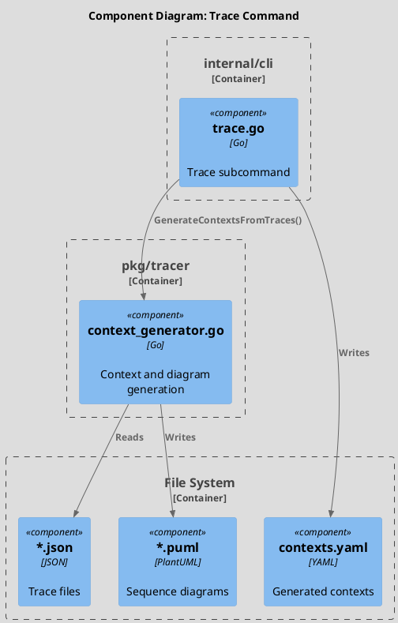
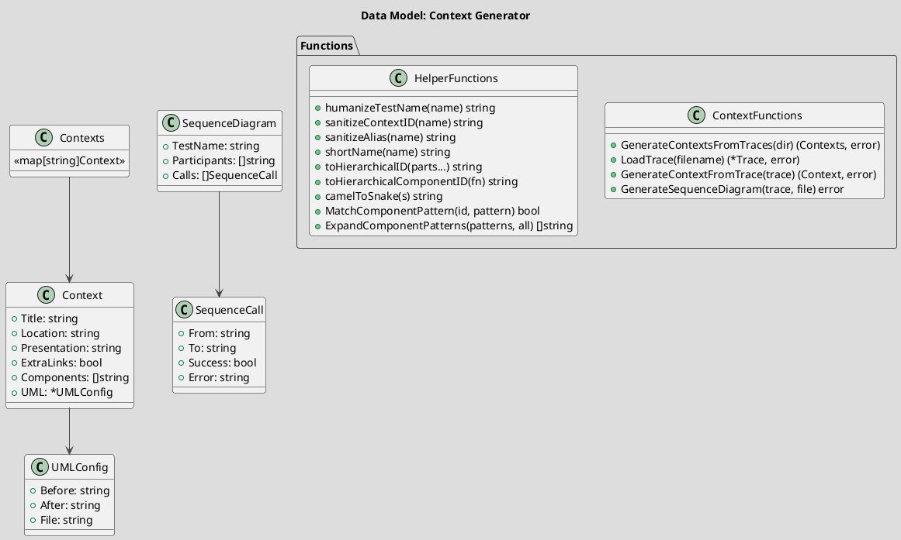
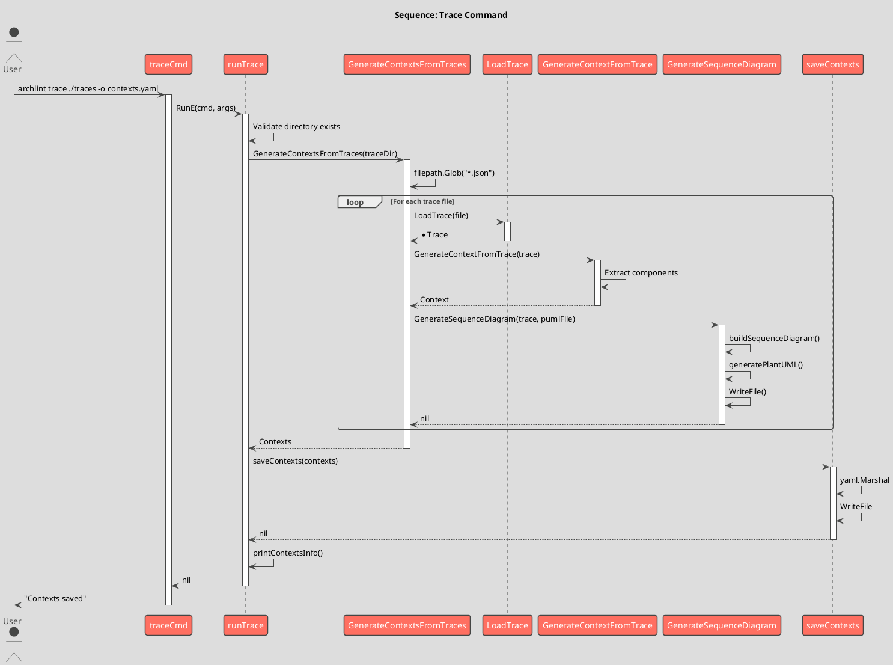
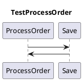

# Spec 0008: Implement Trace Command and Context Generator

**Metadata:**
- Priority: 0008 (High)
- Status: Done
- Created: 2024-12-01
- Effort: L
- Parent Spec: 0007

---

## Overview

### Problem Statement
Необходимо реализовать команду `trace` для генерации DocHub контекстов и PlantUML sequence диаграмм из JSON трассировок тестов.

### Solution Summary
Создать подкоманду trace и модуль context_generator.go в pkg/tracer для преобразования трассировок в контексты и диаграммы.

### Success Metrics
- Команда читает JSON файлы трассировок
- Генерируются DocHub контексты с компонентами
- Генерируются PlantUML sequence диаграммы
- Поддерживаются wildcard паттерны для компонентов

---

## Architecture

### Component Overview (C4 Component)



### Data Model



### Sequence Flow



---

## Requirements

### R1: Trace Command
**Description:** Определение команды trace

```go
// Package: internal/cli
// File: trace.go

var traceCmd = &cobra.Command{
    Use:   "trace [директория с трассировками]",
    Short: "Генерирует контексты из трассировок тестов",
    Long: `Анализирует JSON файлы трассировок и генерирует DocHub контексты.

Каждая трассировка представляет один execution flow (тест) и конвертируется в:
1. DocHub контекст с списком компонентов
2. PlantUML sequence диаграмму`,
    Args: cobra.ExactArgs(1),
    RunE: runTrace,
}
```

### R2: Context Type
**Description:** Структура DocHub контекста

```go
// Package: pkg/tracer
// File: context_generator.go

type Context struct {
    Title        string     `yaml:"title"`
    Location     string     `yaml:"location,omitempty"`
    Presentation string     `yaml:"presentation,omitempty"`
    ExtraLinks   bool       `yaml:"extra-links,omitempty"`
    Components   []string   `yaml:"components"`
    UML          *UMLConfig `yaml:"uml,omitempty"`
}

type UMLConfig struct {
    Before string `yaml:"$before,omitempty"`
    After  string `yaml:"$after,omitempty"`
    File   string `yaml:"file,omitempty"`
}
```

### R3: GenerateContextsFromTraces
**Description:** Главная функция генерации

```go
func GenerateContextsFromTraces(traceDir string) (Contexts, error) {
    contexts := make(Contexts)

    files, err := filepath.Glob(filepath.Join(traceDir, "*.json"))
    // Handle error and empty files

    for _, file := range files {
        trace, err := LoadTrace(file)
        ctx, err := GenerateContextFromTrace(trace)
        err := GenerateSequenceDiagram(trace, pumlFile)
        contexts[contextID] = ctx
    }

    return contexts, nil
}
```

### R4: GenerateContextFromTrace
**Description:** Генерация контекста из одной трассировки

```go
func GenerateContextFromTrace(trace *Trace) (Context, error) {
    componentsMap := make(map[string]bool)

    for _, call := range trace.Calls {
        if call.Event == "enter" {
            hierarchicalID := toHierarchicalComponentID(call.Function)
            componentsMap[hierarchicalID] = true
        }
    }

    return Context{
        Title:        humanizeTestName(trace.TestName),
        Location:     "Tests/" + humanizeTestName(trace.TestName),
        Presentation: "plantuml",
        ExtraLinks:   false,
        Components:   components,
    }, nil
}
```

### R5: GenerateSequenceDiagram
**Description:** Генерация PlantUML диаграммы

```go
func GenerateSequenceDiagram(trace *Trace, outputFile string) error {
    diagram := buildSequenceDiagram(trace)
    puml := generatePlantUML(diagram)
    return os.WriteFile(outputFile, []byte(puml), 0o600)
}
```

### R6: Name Transformations
**Description:** Функции преобразования имен

```go
// TestProcessOrder -> "Process Order"
func humanizeTestName(testName string) string

// TestProcessOrder -> "test-process-order"
func sanitizeContextID(testName string) string

// OrderService.ProcessOrder -> "order_service.process_order"
func toHierarchicalComponentID(functionName string) string

// CamelCase -> snake_case
func camelToSnake(s string) string
```

### R7: Wildcard Pattern Matching
**Description:** Поддержка wildcards для компонентов

```go
// Matches:
// - exact: "pkg.service" matches "pkg.service"
// - single level: "pkg.*" matches "pkg.service" but not "pkg.service.method"
// - recursive: "pkg.**" matches "pkg.service" and "pkg.service.method"
func MatchComponentPattern(componentID, pattern string) bool

func ExpandComponentPatterns(patterns, allComponents []string) []string
```

---

## Acceptance Criteria

- [ ] AC1: traceCmd определен с флагом -o
- [ ] AC2: Читает JSON файлы из директории
- [ ] AC3: Генерирует Context для каждого trace
- [ ] AC4: Components содержат hierarchical IDs
- [ ] AC5: Генерирует PlantUML sequence диаграммы
- [ ] AC6: PlantUML содержит participants
- [ ] AC7: PlantUML содержит arrows для вызовов
- [ ] AC8: Ошибки маркируются в диаграмме
- [ ] AC9: humanizeTestName преобразует имена корректно
- [ ] AC10: sanitizeContextID создает валидные IDs
- [ ] AC11: camelToSnake работает корректно
- [ ] AC12: MatchComponentPattern поддерживает wildcards
- [ ] AC13: Контексты сохраняются в YAML
- [ ] AC14: tracer.Enter/Exit в функциях CLI

---

## Implementation Steps

### Phase 1: CLI Command
**Step 1.1:** Create trace.go in internal/cli
**Step 1.2:** Implement runTrace()
**Step 1.3:** Implement saveContexts()
**Step 1.4:** Implement printContextsInfo()

### Phase 2: Context Generator
**Step 2.1:** Create context_generator.go in pkg/tracer
**Step 2.2:** Define Context, UMLConfig types
**Step 2.3:** Implement LoadTrace()
**Step 2.4:** Implement GenerateContextsFromTraces()
**Step 2.5:** Implement GenerateContextFromTrace()

### Phase 3: Diagram Generator
**Step 3.1:** Define SequenceDiagram, SequenceCall types
**Step 3.2:** Implement buildSequenceDiagram()
**Step 3.3:** Implement generatePlantUML()
**Step 3.4:** Implement GenerateSequenceDiagram()

### Phase 4: Helpers
**Step 4.1:** Implement humanizeTestName()
**Step 4.2:** Implement sanitizeContextID()
**Step 4.3:** Implement toHierarchicalComponentID()
**Step 4.4:** Implement camelToSnake()
**Step 4.5:** Implement MatchComponentPattern()
**Step 4.6:** Implement ExpandComponentPatterns()

---

## Testing Strategy

### Unit Tests
- [ ] Test humanizeTestName
- [ ] Test sanitizeContextID
- [ ] Test camelToSnake
- [ ] Test MatchComponentPattern with wildcards
- [ ] Test GenerateContextFromTrace
- Coverage target: 80%+

### Integration Tests
- [ ] Test full trace command on sample traces

---

## Notes

### PlantUML Output Example


### YAML Output Example
```yaml
contexts:
  tests.test-process-order:
    title: Process Order
    location: Tests/Process Order
    presentation: plantuml
    extra-links: false
    components:
      - order_service.process_order
      - repository.save
    uml:
      file: traces/test_process_order.puml
```

### Wildcard Examples
```yaml
# Single level wildcard
components:
  - pkg.service.*   # matches pkg.service.Create, pkg.service.Update

# Recursive wildcard
components:
  - pkg.**          # matches pkg.service.Create, pkg.service.repo.Save
```
