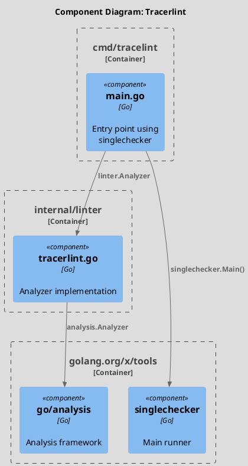
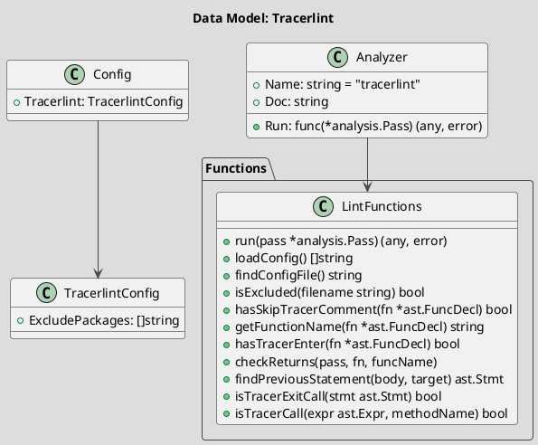

# Spec 0009: Implement Tracerlint Linter

**Metadata:**
- Priority: 0009 (High)
- Status: Done
- Created: 2024-12-01
- Effort: M
- Parent Spec: 0007

---

## Overview

### Problem Statement
Необходимо обеспечить наличие tracer.Enter() и tracer.ExitSuccess()/ExitError() во всех функциях проекта. Ручная проверка неэффективна.

### Solution Summary
Создать статический анализатор (linter) на базе golang.org/x/tools/go/analysis, который проверяет наличие tracer вызовов в функциях.

### Success Metrics
- Linter обнаруживает отсутствующие tracer.Enter()
- Linter обнаруживает return без tracer.Exit*
- Поддерживается конфигурация исключений
- Поддерживается @skip-tracer комментарий

---

## Architecture

### Component Overview (C4 Component)



### Data Model



---

## Requirements

### R1: Analyzer Definition
**Description:** Определение анализатора

```go
// Package: internal/linter
// File: tracerlint.go

var Analyzer = &analysis.Analyzer{
    Name: "tracerlint",
    Doc:  "checks that all functions have tracer.Enter() and tracer.ExitSuccess/ExitError() before returns",
    Run:  run,
}
```

### R2: Configuration Support
**Description:** Загрузка конфигурации из .archlint.yaml

```go
type Config struct {
    Tracerlint struct {
        ExcludePackages []string `yaml:"exclude_packages"`
    } `yaml:"tracerlint"`
}

func loadConfig() []string {
    // Find .archlint.yaml
    // Parse YAML
    // Return exclude_packages
}
```

### R3: Exclusion Logic
**Description:** Исключение пакетов и файлов

- Пропускать файлы из go-build cache
- Пропускать _test.go файлы
- Пропускать пакеты из exclude_packages
- Пропускать функции с @skip-tracer комментарием

### R4: Entry Check
**Description:** Проверка tracer.Enter() в начале функции

```go
func hasTracerEnter(fn *ast.FuncDecl) bool {
    if len(fn.Body.List) == 0 {
        return false
    }
    firstStmt := fn.Body.List[0]
    // Check if it's tracer.Enter() call
}
```

### R5: Exit Check
**Description:** Проверка tracer.Exit* перед каждым return

```go
func checkReturns(pass *analysis.Pass, fn *ast.FuncDecl, funcName string) {
    ast.Inspect(fn.Body, func(n ast.Node) bool {
        // Skip anonymous functions
        // Find return statements
        // Check previous statement is tracer.Exit*
    })
}
```

### R6: Entry Point
**Description:** Отдельный бинарник tracelint

```go
// Package: main
// File: cmd/tracelint/main.go

func main() {
    singlechecker.Main(linter.Analyzer)
}
```

---

## Acceptance Criteria

- [ ] AC1: internal/linter/ директория создана
- [ ] AC2: Analyzer определен с Name="tracerlint"
- [ ] AC3: cmd/tracelint/main.go создан
- [ ] AC4: Читает конфигурацию из .archlint.yaml
- [ ] AC5: Исключает пакеты из exclude_packages
- [ ] AC6: Исключает _test.go файлы
- [ ] AC7: Исключает go-build cache файлы
- [ ] AC8: Поддерживает @skip-tracer комментарий
- [ ] AC9: Проверяет tracer.Enter() в начале
- [ ] AC10: Проверяет tracer.Exit* перед return
- [ ] AC11: Выдает понятные сообщения об ошибках
- [ ] AC12: Корректно обрабатывает вложенные блоки
- [ ] AC13: Пропускает анонимные функции
- [ ] AC14: Makefile обновлен с lint target

---

## Implementation Steps

### Phase 1: Setup
**Step 1.1:** Create linter directory
- Files: internal/linter/
- Action: Create directory
- Details: `mkdir -p internal/linter`

**Step 1.2:** Add x/tools dependency
- Action: Run
- Details: `go get golang.org/x/tools/go/analysis`

**Step 1.3:** Create tracelint directory
- Files: cmd/tracelint/
- Action: Create directory
- Details: `mkdir -p cmd/tracelint`

### Phase 2: Configuration
**Step 2.1:** Implement loadConfig()
**Step 2.2:** Implement findConfigFile()
**Step 2.3:** Implement isExcluded()

### Phase 3: Core Analysis
**Step 3.1:** Implement run()
**Step 3.2:** Implement hasSkipTracerComment()
**Step 3.3:** Implement getFunctionName()
**Step 3.4:** Implement hasTracerEnter()
**Step 3.5:** Implement checkReturns()
**Step 3.6:** Implement findPreviousStatement()
**Step 3.7:** Implement isTracerExitCall()
**Step 3.8:** Implement isTracerCall()

### Phase 4: Entry Point
**Step 4.1:** Create cmd/tracelint/main.go
**Step 4.2:** Update Makefile with lint target

---

## Testing Strategy

### Unit Tests
- [ ] Test hasTracerEnter with valid function
- [ ] Test hasTracerEnter without tracer
- [ ] Test checkReturns finds missing Exit
- [ ] Test isExcluded with config
- Coverage target: 80%+

### Integration Tests
- [ ] Run on archlint codebase
- [ ] Verify all violations detected

---

## Notes

### Configuration Example
```yaml
# .archlint.yaml
tracerlint:
  exclude_packages:
    - pkg/tracer
    - internal/linter
```

### Error Messages
```
function ProcessOrder missing tracer.Enter() at the beginning
return in ProcessOrder must be preceded by tracer.ExitSuccess() or tracer.ExitError()
```

### Makefile Addition
```makefile
TRACELINT := $(BIN_DIR)/tracelint

lint: ## Run linters
	@echo "--- golangci-lint ---"
	@golangci-lint run ./... || true
	@echo "--- tracelint ---"
	@mkdir -p $(BIN_DIR)
	go build -o $(TRACELINT) ./cmd/tracelint
	@$(TRACELINT) ./internal/... ./pkg/... ./cmd/... || true
```

### Handling Nested Blocks
- Switch/Case statements
- Select/Comm clauses
- If/For/Range blocks
- Need recursive findPreviousStatement()
