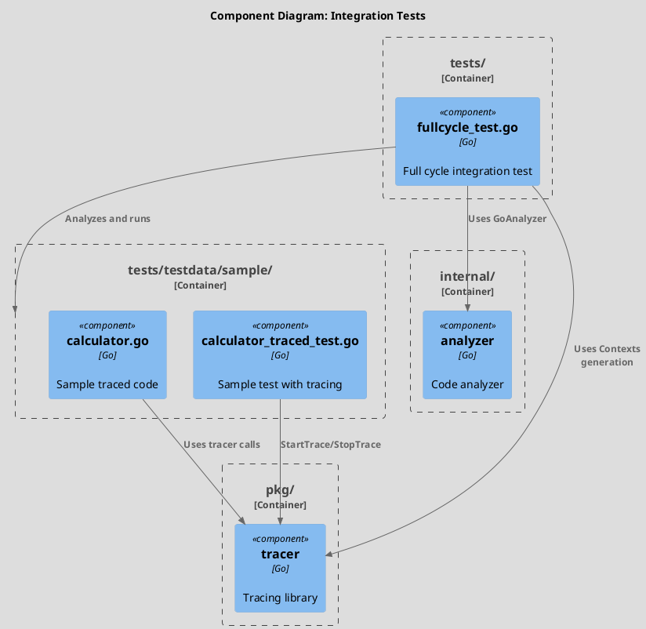
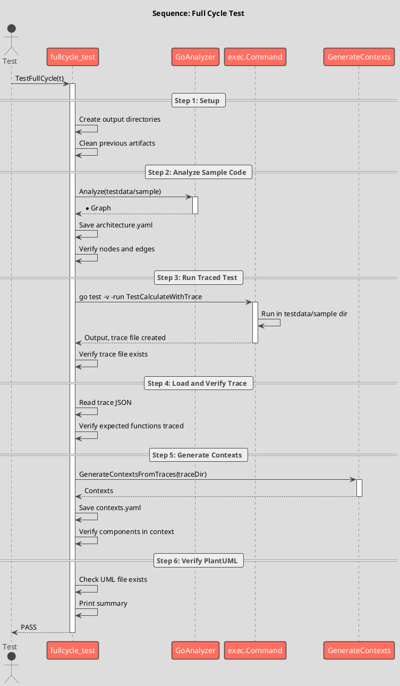

# Spec 0010: Implement Integration Tests

**Metadata:**
- Priority: 0010 (High)
- Status: Done
- Created: 2024-12-01
- Effort: M
- Parent Spec: 0007

---

## Overview

### Problem Statement
Необходимо проверить корректность работы всего pipeline archlint: от анализа кода до генерации контекстов из трассировок.

### Solution Summary
Создать интеграционный тест TestFullCycle, который проверяет полный цикл работы с использованием sample кода.

### Success Metrics
- Тест проверяет collect (анализ кода)
- Тест проверяет trace (генерация контекстов)
- Тест использует реальный sample код с трассировкой
- Все компоненты интегрируются корректно

---

## Architecture

### Component Overview (C4 Component)



### Sequence Flow



---

## Requirements

### R1: Test Structure
**Description:** Создать структуру тестовых директорий

```
tests/
├── fullcycle_test.go
├── output/           (generated, gitignored)
│   ├── architecture.yaml
│   ├── contexts.yaml
│   └── traces/
└── testdata/
    └── sample/
        ├── calculator.go
        └── calculator_traced_test.go
```

### R2: Sample Code
**Description:** Создать sample код с tracer вызовами

```go
// tests/testdata/sample/calculator.go
package sample

type Calculator struct {
    memory int
}

func NewCalculator() *Calculator {
    tracer.Enter("sample.NewCalculator")
    tracer.ExitSuccess("sample.NewCalculator")
    return &Calculator{memory: 0}
}

func (c *Calculator) Calculate(a, b int) int {
    tracer.Enter("sample.Calculator.Calculate")
    // ... calculations with nested calls
    tracer.ExitSuccess("sample.Calculator.Calculate")
    return result
}
```

### R3: Sample Test with Tracing
**Description:** Тест, который создает трассировку

```go
// tests/testdata/sample/calculator_traced_test.go
func TestCalculateWithTrace(t *testing.T) {
    trace := tracer.StartTrace("TestCalculateWithTrace")
    defer func() {
        trace = tracer.StopTrace()
        trace.Save("traces/test_calculate.json")
    }()

    calc := NewCalculator()
    result := calc.Calculate(5, 3)
    // assertions
}
```

### R4: Full Cycle Test
**Description:** Интеграционный тест

```go
// tests/fullcycle_test.go
func TestFullCycle(t *testing.T) {
    // Step 1: Setup output directories
    // Step 2: Analyze sample code with GoAnalyzer
    // Step 3: Run traced test via exec.Command
    // Step 4: Verify trace file and contents
    // Step 5: Generate contexts from traces
    // Step 6: Verify all traced functions in context
    // Step 7: Verify PlantUML diagram generated
}
```

### R5: Assertions
**Description:** Что проверять

- Graph содержит expected nodes и edges
- Trace file создан
- Trace содержит expected functions
- Context содержит all traced components
- PlantUML file существует

---

## Acceptance Criteria

- [ ] AC1: tests/ директория создана
- [ ] AC2: tests/testdata/sample/ содержит sample код
- [ ] AC3: calculator.go с tracer вызовами
- [ ] AC4: calculator_traced_test.go с трассировкой
- [ ] AC5: fullcycle_test.go реализован
- [ ] AC6: Тест создает output директории
- [ ] AC7: Тест анализирует sample код
- [ ] AC8: Тест запускает traced test
- [ ] AC9: Тест проверяет trace file
- [ ] AC10: Тест генерирует contexts
- [ ] AC11: Тест проверяет PlantUML
- [ ] AC12: `go test ./tests/...` проходит
- [ ] AC13: Output в tests/output/ (gitignored)

---

## Implementation Steps

### Phase 1: Directory Setup
**Step 1.1:** Create tests directory structure
- Files: tests/, tests/testdata/sample/
- Action: Create directories
- Details: `mkdir -p tests/testdata/sample`

### Phase 2: Sample Code
**Step 2.1:** Create calculator.go
- Files: tests/testdata/sample/calculator.go
- Details: Calculator with tracer calls

**Step 2.2:** Create calculator_traced_test.go
- Files: tests/testdata/sample/calculator_traced_test.go
- Details: Test that creates trace

### Phase 3: Integration Test
**Step 3.1:** Create fullcycle_test.go
- Files: tests/fullcycle_test.go
- Details: Full cycle test

**Step 3.2:** Implement test steps
- Setup, analyze, run, verify

### Phase 4: Gitignore
**Step 4.1:** Update .gitignore
- Details: Add tests/output/

---

## Testing Strategy

### Unit Tests
- N/A (this IS the integration test)

### Integration Tests
- [ ] TestFullCycle verifies entire pipeline
- [ ] Sample code compiles
- [ ] Sample test runs
- Coverage target: N/A

---

## Notes

### Sample Calculator Functions
```go
func Add(a, b int) int
func Multiply(a, b int) int
func (c *Calculator) AddToMemory(value int)
func (c *Calculator) GetMemory() int
func (c *Calculator) Calculate(a, b int) int
```

### Expected Trace Functions
```
sample.NewCalculator
sample.Calculator.Calculate
sample.Add
sample.Multiply
sample.Calculator.AddToMemory
sample.Calculator.GetMemory
```

### Helper Functions in Test
```go
func copyFile(src, dst string) error
func toHierarchicalComponentID(functionName string) string
func camelToSnake(s string) string
```

### Test Output
```
=== RUN   TestFullCycle
Step 1: Collecting architecture from sample code
Architecture saved to output/architecture.yaml
Found 6 components and 8 links
Step 2: Running traced test
Step 3: Checking trace file exists
Trace contains 12 calls
Step 4: Generating context from trace
Generated 1 contexts
Step 5: Verifying all traced components are in context
Function sample.NewCalculator found in context
Function sample.Calculator.Calculate found in context
PlantUML diagram: output/traces/test_calculate.puml
Full cycle test completed successfully!
--- PASS: TestFullCycle
```
